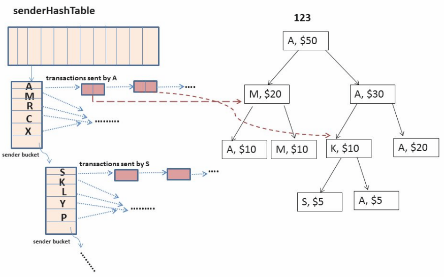

# BitCoin Transactions

This program is implemented by a set of structures such as hash tables, linked lists and trees, in order to perform many bitcoin-related operations.

## Run
./bitcoin -a bitCoinBalancesFile –t transactionsFile -v bitCoinValue senderHashtableNumOfEntries –h2 receiverHashtableNumOfEntries –b bucketSize

## An example of the Data Structure use:

## Implementation
+ bitCoinValue: the value of a bitcoin in $.
+ senderHashtable1NumOfEntries: the available space of a hash table used in order to locate the sender's information.
+ receiverHashtable1NumOfEntries: the available space of a hash table used in order to locate the receiver's information.
+ bucketSize: the amount of Bytes for every bucket of both hash tables.
+ bitCoinBalancesFile: is a file that contains the initial balances of the users participating in the bitcoin network. For example the contents of the file are:

Mia 123 337 880 667
Kylian 456 767 898
Katerina 222 567 003

which means that Mia has four bitcoins with bitCoinIDs 123, 337, 880, 667. Kylian has 3 bitcoins with IDs 456, 767, 898, and lastly, Katerina has 3 bitcoins with IDs 222, 567, 003.
+ transactionsFile: is a file that contains a number of requests (transactions) to be processed. Each line of this file describes a transaction with the sender's and receiver's userIDs and the amount (in $) sent by the sender. For example if the contents of the file are:

889 Maria Ronaldo 50 25-12-2018 20:08
776 Lionel Antonella 150 14-02-2019 10:05

which means that we hae two transactions. One in which Maria asks to send 50$ to Ronaldo on 25-12-2018 8:08pm, and one that Lionel asks to send Antonella 150$ on 14-02-2019 10:05am.
Specifically, a transaction record / request is an ASCII line of text consisting of
following items:

⋅⋅1. transactionID: a string (it can only have digits) that determines, in a unique way, each record.
⋅⋅2. senderWalletID: a string consisting of letters.
⋅⋅3. receiverWalletID: a string consisting of letters.
⋅⋅4. value: the integer amount of the transaction.
⋅⋅5. date: date the transaction request is made. Has this kind of format: DD-MM-YYYY.
⋅⋅6. time: exact time, in the 24 hours, that the transaction request was made. Must be in this kind of format HH:MM.

The program starts by reading line by line the input files and initialize and save to the memory the data structures it will use when executing the queries. Futhermor, a validation check of the input is made.
When the application finishes processing the bitCoinBalancesFile and transactionsFile, it waits for user's input from the keyboard. The user is to give the following commands:

+ /requestTransaction senderWalletID receiverWalletID amount date time

by which the user requests to send an amount of money from the user with senderWalletID to the user with receiverWalletID, at a specific date and time.
+ /requestTransactions senderWalletID receiverWalletID amount date time;
  senderWalletID2 receiverWalletID2 amount2 date2 time2;
  ...
  senderWalletIDn receiverWalletIDn amountn daten timen;

by which the user requests a series of transactions to be executed.
+ /requestTransactions inputFile

by which the user requests that the transactions described in the inputFile are to be executed. These transactions have the same format as the transactions of the requestTransaction(s) queries. 
+ /findEarnings walletID [time1][year1][time2][year2]

by which the application, firstly, returns the total amount received by the user through transactions with userID walletID (by selecting the time range and / or date). Afterwards, it presents all of the user's transaction records (as a receiver) that were succesfully executed in that range of time. If there is no specification of the time period, then the application presents the complete transaction history in which walleyID is the receiver.
+ /walletStatus walletID

The application returns the current amount in wallet walletID.
+ /bitCoinStatus bitCoinID

The application returns the original value of bitcoin with bitCoinID ID, the number of transactions in which it has been used, and the amount of bitCoinID that has remained unspent (ie has not yet been used in a transaction).
+ /traceCoin bitCoinID

The application returns the trading history in which bitcoin bitCoinID is involved.
+ /exit

Exit the application. Release all the memory.

